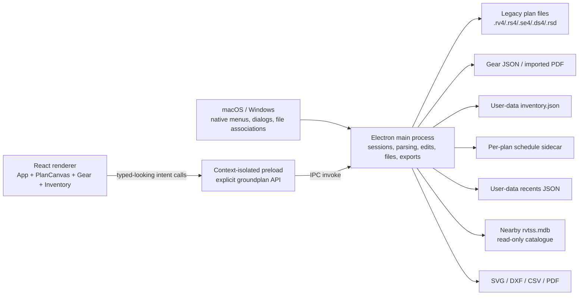

# Groundplan system audit and refinement plan

**Audit date:** 2026-07-29
**Scope:** Groundplan 1.0.0 in `/Users/princedavidthompson/Groundplan`
**Platforms:** macOS and Windows desktop
**Status:** Audit complete and verified local-desktop findings implemented. See
`docs/workhorse-refinement-changelog.md` for the delivered changes and release
validation.

## Executive decision

Groundplan is a capable local desktop plan editor with unusually strong legacy-file safety, not the multi-department web platform described in the broad product brief.

The correct next move is therefore:

1. Protect the current local data paths and fix the verified P0/P1 workflow defects.
2. Refactor the shell around the three real workspaces—Plan, Gear, and Inventory.
3. Introduce a small local Show/project record that deliberately links a plan, gear list, schedule metadata, and exports.
4. Add a cloud service, authentication, organizational roles, PostgreSQL, and row-level security only if multi-user collaboration is confirmed as a product requirement.

Building Sales, Crew, Logistics, Finance, Client, and Freelancer portals before those foundations would create fictional UI over data relationships that do not exist.

## Evidence convention

- **Verified** means traced in source code, exercised in the isolated development build, or demonstrated by the current automated tools.
- **Inferred user** means a practical persona suggested by the feature, not an authenticated role.
- **Proposed** means a future product or architecture decision; it is not represented as current functionality.
- `P0` means data loss, wrong-record mutation, or a release blocker. `P1` means a high-impact daily workflow, security, or reliability defect. `P2` means an important architecture, accessibility, or scale problem. `P3` means polish or documentation.

## Validation performed

- Read the Electron main, preload, renderer, format, gear, inventory, test, build, and packaging code.
- Searched the entire source tree for network clients, API routes, database schemas, authentication, authorization, tenant, migration, and RLS code.
- Inspected Plan, Gear, Inventory, empty states, canvas, selection tools, toolbar, left rail, and inspector in an isolated Electron development profile.
- Kept the installed Groundplan application and its unsaved document untouched.
- Ran `npm run typecheck`, `npm test`, and `npm run build`; all completed successfully.
- Ran `npm audit --omit=dev`: no production-package findings.
- Ran the full `npm audit`: 32 dependency-tree findings as of the audit date, including direct high-severity findings against the packaged Electron runtime and the Electron build chain. Electron is declared as a development dependency but its runtime is distributed with the desktop app, so it cannot be dismissed as test-only.

---

# A. Current system map

## A1. Runtime boundaries



**Verified boundaries**

- The renderer has no Node access. `contextIsolation` is on and `nodeIntegration` is off (`src/main/index.ts:446-461`).
- The preload exposes a finite intent API rather than raw `fs` or arbitrary IPC channels (`src/preload/index.ts:27-239`).
- The main process owns parsing, editing, filesystem writes, inventory, gear, schedules, exports, and native dialogs (`src/main/index.ts`).
- The renderer receives a flattened scene and sends edit requests such as move, arrange, place, and annotate (`src/main/index.ts:324-415`).
- Production loads a bundled HTML file; development loads the Vite URL (`src/main/index.ts:487-491`).
- The renderer CSP permits self-hosted code and local/data images, with no configured remote API (`src/renderer/index.html:6-9`).

## A2. Actual product surfaces

| Surface | Responsibility | Inferred primary user | Reads | Writes | Begins/ends workflows | Dependencies |
| --- | --- | --- | --- | --- | --- | --- |
| Plan workspace | Open, inspect, edit, annotate, measure, place equipment, arrange objects, print, and export a legacy plan | Event designer / project manager | Current `Session`, recent paths, folder listing, global inventory, nearby catalogue | Legacy plan, `.bak`, schedule sidecar, exports, UI preferences | Open → edit → save/reopen; gear/inventory placement → plan; plan → CAD/print/schedule | Parser, serializer, editor, scene builder, inventory, native dialogs |
| Gear workspace | Import or open a job gear list, edit hierarchy and quantities, track prep, export CSV, compare with the open plan | Warehouse / project manager | Imported PDF or `.gear.json`, current open plan scene | In-memory gear; explicit `.gear.json` save; CSV export | PDF → working gear list → prep → save/export; current gear + current plan → reconciliation | PDF parser, gear model/store, reconcile service |
| Inventory workspace | Maintain the reusable company equipment catalogue and symbol mappings | Inventory manager / designer | `inventory.json`, gear PDFs, CSVs, plans and shape libraries | `inventory.json`; plan placement through Plan | Import/harvest → classify/map → correct size → place on plan | Inventory model/store, classifier, matcher, symbol importer |
| Recent/folder rail | Reopen recent plans or browse a directory | Any local operator | User-data recents; directory entries | Recents timestamps | Start/open workflow | Native filesystem |
| Plan inspector | Plan facts, transforms, selection properties, annotation, seating, layers, in-plan counts | Designer | Current renderer document and selection | Edit intents, layer visibility, tool state | Select → inspect/edit; create → place | Main-process editor plus renderer state |
| Native dialogs and menus | Open, save, confirm destructive action, close, export, fullscreen | Any local operator | OS state and application dirty state | User-selected files | Entry, save, export, quit | Electron |
| Print popover and status/toasts | Configure PDF and report transient progress/success/error | Designer | Current plan and UI state | PDF export | Plan → printable file | Renderer SVG plus main PDF service |

There is no dashboard, global search, notification center, account page, settings page, role dashboard, client portal, mobile navigation, or multi-show queue.

## A3. State ownership

| State | Current source of truth | Lifetime | Durability |
| --- | --- | --- | --- |
| Open plan and undo/redo | One main-process `Session` global (`src/main/index.ts:257-258`) | Process/session | Plan save only; undo is memory-only |
| Open gear list | One main-process global (`src/main/index.ts:304-305`) mirrored in React | Process/session | Manual `.gear.json` save |
| Company inventory | Main-process global loaded from user data | Across launches | Autosaved `inventory.json` |
| Recent plans | Main-process path list and timestamps | Across launches | Two user-data JSON files |
| Schedule custom fields | JSON keyed beside current plan | Across launches while path/key remains stable | Direct sidecar write |
| Canvas view, active tools, filters, drafts, selection | React component state | Current mount/session | Mostly not durable |
| Panel open/closed | React plus Chromium `localStorage` | Across launches | Two localStorage keys |
| Legacy shape catalogue | Nearby `rvtss.mdb` | Read-time cache | Read-only external data |

`App.tsx` is 2,184 lines and owns 54 independent state cells. `src/main/index.ts` is 1,679 lines and registers 56 IPC handlers. This concentration is a primary source of coordination complexity.

## A4. Current data flow

### Open and render

1. A recent item, folder item, native dialog, file association, or command-line path reaches the renderer.
2. `file:open` reads the whole file in the main process (`src/main/index.ts:349-353`).
3. `Session` parses it, checks archive-body round-trip identity, builds an index and scene, and determines editability (`src/main/session.ts:35-43`).
4. A complete flattened scene crosses IPC to React.
5. The canvas caches geometry bounds and colors, culls offscreen primitives, and paints the visible scene (`src/renderer/src/PlanCanvas.tsx:198-251`, `353-407`).

### Edit and save

1. React sends an edit intent with current object IDs.
2. The main process takes a full serialized checkpoint, applies a byte-level edit, rebuilds the index and scene, and returns a complete document payload (`src/main/index.ts:384-415`).
3. React replaces its document state and marks Save available.
4. Normal save creates a one-time `.bak`, writes a temporary file, and renames it over the target (`src/main/index.ts:1426-1460`).

### Gear and inventory

- Gear PDF import reconstructs departments/packages from PDF text positions, then keeps the result in memory until explicitly saved.
- Inventory imports names, dimensions, and symbols from PDF/CSV/plan/library sources and saves after each mutation.
- Gear placement and inventory placement both end as plan edit intents.
- Reconciliation compares whichever gear list and plan happen to be open; no record says they belong to the same job (`src/main/index.ts:1173-1178`).

## A5. Authentication, permissions, database, and organization status

**Verified absent**

- No login, account, authentication token, session service, RBAC, permission table, organization, tenant, or RLS.
- No application API server, HTTP client, WebSocket, background sync, ORM, SQL schema, migration folder, writable database, or cloud file service.
- No department boundary. Gear `department` is a label used for grouping, not a permission boundary.
- No role-specific renderer branch. The only meaningful capabilities are whether the current legacy plan round-trips safely and whether a plan is available for placement.

**Verified present**

- A legacy Jet/Access catalogue may be found near a plan and is opened read-only (`src/format/catalog.ts:1-50`).
- Security relies on the local OS account, filesystem permissions, CSP, context isolation, and the preload boundary.

## A6. Current “Show” lifecycle

No Show/job entity exists. A gear list may contain `jobNumber`, `title`, and `location`, but the plan has no durable link to it (`src/gear/model.ts:33-42`). Inventory claims to count jobs through `timesSeen`, but repeated import of the same job increments it because no job identity exists (`src/inventory/model.ts:145-189`).

The broad requested lifecycle is therefore:

| Requested stage | Current implementation |
| --- | --- |
| Lead → Opportunity → Proposal → Client review | Not present |
| Confirmed show / production planning | A plan and gear list can be open, but are not durably associated |
| Crew preparation | Not present |
| Gear preparation | Present locally in Gear, including tick-off progress |
| Logistics | Not present |
| Show day | Gear tick-off can be used, but there is no show-day workflow |
| Wrap / reconciliation | Plan-vs-gear comparison exists, but is manual and can become stale |
| Invoicing / archive | Not present beyond local files and recents |

---

# B. Prioritized findings

## What already deserves preservation

- Legacy archive-body round-trip gating before edits are allowed (`src/main/session.ts:35-43`).
- Byte-patch editing that preserves unknown fields.
- One-time plan backup and temporary-file replacement.
- Dirty state based on actual bytes last saved, not undo depth (`src/main/session.ts:45-57`).
- Single-instance production behavior and unsaved plan/gear close protection.
- Separate development user data, protecting the installed application.
- Cross-platform native menus and shortcut modifiers.
- Canvas frame coalescing, cached bounds, viewport culling, and fluid trackpad/mouse navigation foundations.
- Persistent dimensions, multi-selection, arrange/mirror/recolor/resize, seating, real symbol import, and reconciliation.
- Backward-compatible readers for older inventory, recents, and gear formats.

## B1. Gear IDs can target the wrong row after restart

- **Category:** Backend/data, workflow, reliability
- **Severity:** P0
- **Evidence:** Gear IDs come from a module counter starting at zero (`src/gear/model.ts:152-155`). Opening saved JSON does not reseed or validate it (`src/gear/store.ts:27-34`). Add calls `nextId()` directly (`src/main/index.ts:1211-1229`).
- **User impact:** After reopening a saved list, adding an item can duplicate an existing `g1`; edit or delete may then mutate the first matching row instead of the visible target.
- **Technical cause:** Process-local identity is being used as durable record identity.
- **Affected files/services:** `src/gear/model.ts`, `src/gear/store.ts`, `src/main/index.ts`, `src/renderer/src/GearView.tsx`; no database object exists.
- **Recommended solution:** Use `crypto.randomUUID()` for every gear list, department, and item; validate uniqueness on load; add a deterministic repair migration for duplicates.
- **Dependencies:** Versioned gear schema, atomic write service, migration fixture.
- **Change risk:** Medium. IDs are internal today, but migration must preserve hierarchy and avoid breaking React keys.

## B2. Save can overwrite an externally changed plan

- **Category:** Workflow, backend, reliability
- **Severity:** P0
- **Evidence:** A file is read once on open (`src/main/index.ts:349-353`) and later overwritten without comparing the current disk version (`src/main/index.ts:1410-1460`). The single-instance lock covers only Groundplan processes.
- **User impact:** A colleague on a network share, legacy Room Viewer, sync tool, or other editor can change the plan after it opens; Groundplan can silently replace that newer work.
- **Technical cause:** The session retains the opening bytes but has no save precondition.
- **Affected files/services:** `src/main/session.ts`, `src/main/index.ts`; legacy plan file.
- **Recommended solution:** Store size, mtime, and SHA-256 at open. Before overwrite, compare the current file and offer Reload, Save As, or explicitly reviewed Overwrite.
- **Dependencies:** Typed conflict result, conflict dialog, network-share tests.
- **Change risk:** Low to medium. False positives from timestamp-only checks are avoided by hashing.

## B3. There is no durable Show/job spine

- **Category:** Information architecture, workflow, backend/data
- **Severity:** P1
- **Evidence:** Plan, gear, and inventory are independent main-process globals (`src/main/index.ts:257-305`). Reconcile uses the currently open pair only (`src/main/index.ts:1173-1178`). No project manifest, foreign key, database, or shared identifier exists.
- **User impact:** The UI can imply related work without proving the relationship. Users must remember which plan belongs to which gear list; exports, status, approvals, and lifecycle context cannot be traced.
- **Technical cause:** The product grew from a file viewer/editor, so “open file” is the organizing concept.
- **Affected files/services:** Entire app shell; main state; gear model; recents; sidecars. No current database objects.
- **Recommended solution:** Introduce a versioned local Show/project manifest first, linking immutable UUIDs for plans, gear, schedule metadata, exports, job number, venue, dates, and status. Move to local SQLite only when transaction/search/audit requirements justify it.
- **Dependencies:** Stable IDs, repositories, migrations, recovery UI.
- **Change risk:** High if attempted as a rewrite; medium when added alongside existing open-file flows and made opt-in first.

## B4. Commands are not scoped to the visible workspace

- **Category:** Interaction design, information architecture, frontend architecture
- **Severity:** P1
- **Evidence:** Opening a plan adopts it but does not navigate to Plan (`src/renderer/src/App.tsx:252-306`). Plan-only Undo, Fit, paper, snap, Measure, Print, and Export are enabled whenever any plan is loaded, even in Gear or Inventory (`src/renderer/src/App.tsx:1025-1073`). Inventory Save means “save the hidden plan” because only Gear receives special routing (`src/renderer/src/App.tsx:1096-1104`). The footer always reports plan context (`src/renderer/src/App.tsx:2163-2180`).
- **User impact:** Actions can appear to do nothing or change a hidden document. A plan opened while viewing Inventory is successfully loaded without becoming visible.
- **Technical cause:** One static toolbar is driven by globally available documents instead of active-workspace capabilities.
- **Affected files/services:** `App.tsx`, native menu command routing, status bar.
- **Recommended solution:** Define a command registry with `workspace`, `enabled`, `visible`, `label`, `shortcut`, and handler. Successful open navigates to its destination. Scope title, status, Save, Undo, export, and creation tools to the active workspace.
- **Dependencies:** App shell extraction and workspace state.
- **Change risk:** Medium. Shortcut behavior and menu routing require regression coverage.

## B5. Navigation override can place or measure instead of pan

- **Category:** Interaction design, workflow
- **Severity:** P1
- **Evidence:** In pointer-down, armed placement and measurement consume left-click before Hand, Space, Alt, middle/right-button panning is evaluated (`src/renderer/src/PlanCanvas.tsx:549-608`). The cursor still reports Pan (`src/renderer/src/PlanCanvas.tsx:697-705`).
- **User impact:** The UI promises fluid navigation but a temporary navigation gesture can accidentally place an item or set a measurement point.
- **Technical cause:** Tool precedence is spread across several booleans and checked in the wrong order.
- **Affected files/services:** `PlanCanvas.tsx`, `App.tsx` tool state.
- **Recommended solution:** Evaluate temporary navigation overrides first and replace `armed*`, `measuring`, `dimensioning`, and Hand booleans with one discriminated `ActiveTool` state plus Space as a temporary override.
- **Dependencies:** Tool-state refactor and pointer interaction tests.
- **Change risk:** Medium because selection, measurement, dimension, placement, and Escape behavior all intersect.

## B6. Recent plans disappear after opening a folder

- **Category:** Information architecture, interaction design
- **Severity:** P1
- **Evidence:** The Plan rail renders `folder ? folder-list : recents-and-inventory-palette` (`src/renderer/src/App.tsx:1227-1293`). `setFolder` has no clear/back path (`src/renderer/src/App.tsx:308-321`).
- **User impact:** Recent Plans—and the plan-side inventory palette—cannot be reached again in that run without restarting.
- **Technical cause:** Three sources were implemented as mutually exclusive render branches instead of navigable rail modes.
- **Affected files/services:** `App.tsx`, `InventoryPalette.tsx`.
- **Recommended solution:** Add explicit Recent / Folder / Equipment source modes, a folder breadcrumb, Change Folder, Refresh, and Back to Recents. Preserve recent access independently of the folder listing.
- **Dependencies:** PlanBrowser component and small persisted rail state.
- **Change risk:** Low.

## B7. Reconciliation can be mismatched or stale

- **Category:** Workflow, data integrity, interaction design
- **Severity:** P1
- **Evidence:** The UI checks only whether any plan is open, not whether its job context matches (`src/renderer/src/GearView.tsx:327-345`). The report is component-local state and is not invalidated when plan, active gear list, quantity, or description changes (`src/renderer/src/GearView.tsx:275-385`).
- **User impact:** Warehouse staff can make decisions from a comparison of the wrong plan or from results calculated before later edits.
- **Technical cause:** No durable relationship or revision token is attached to a reconciliation result.
- **Affected files/services:** `GearView.tsx`, reconcile IPC, future Show model.
- **Recommended solution:** Display “Gear X compared with Plan Y at time/revisions Z.” Require or warn on identity mismatch. Recalculate or mark stale whenever either revision changes.
- **Dependencies:** Stable Show links and plan/gear revision counters.
- **Change risk:** Low for invalidation; medium for durable association.

## B8. Schedule metadata identity is unstable and Save As loses it

- **Category:** Backend/data, workflow
- **Severity:** P1
- **Evidence:** Metadata keys are lowercased name plus position rounded to one inch (`src/format/schedule.ts:43-50`). Moves and renames change the key; coincident same-name objects collide. Sidecar location derives from `session.path`, but Save As changes that path without copying metadata (`src/main/index.ts:1457-1561`).
- **User impact:** Custom schedule fields can disappear after a move, rename, collision, or Save As.
- **Technical cause:** A “stable-ish” visual key substitutes for durable object identity.
- **Affected files/services:** `src/format/schedule.ts`, schedule handlers, plan Save As, future project store.
- **Recommended solution:** Give schedule rows UUIDs in project metadata and maintain an object-anchor fingerprint with last-known transform. Copy project metadata atomically during Save As and surface ambiguous rematches.
- **Dependencies:** Project repository and migration strategy.
- **Change risk:** Medium to high because the legacy format has no known safe custom-ID field.

## B9. Persistent dimensions are static, not associated with measured objects

- **Category:** Interaction design, workflow, data model
- **Severity:** P1
- **Evidence:** Saved measurement/dimension calls carry four coordinates only (`src/renderer/src/App.tsx:533-547`, `1369-1389`; `src/preload/index.ts:129-133`). No object ID or attachment anchor is stored.
- **User impact:** The distance now stays on the plan, but it does not update when either object moves. That falls short of professional associative dimensioning.
- **Technical cause:** The legacy dimension is a line and label, not a relationship.
- **Affected files/services:** `App.tsx`, `PlanCanvas.tsx`, `annotate.ts`, future metadata store.
- **Recommended solution:** Preserve detached coordinate dimensions and add optional associative endpoints `{objectUuid, anchorKind, offset}`. Snap to object edges/centers and recompute when transforms commit.
- **Dependencies:** Stable object identity and anchor hit-testing.
- **Change risk:** High if written into unknown legacy bytes; medium when relationship data remains in a versioned sidecar/project store.

## B10. Dimension creation is template-dependent and can partially succeed

- **Category:** Workflow, backend reliability
- **Severity:** P1
- **Evidence:** Creating an annotation clones an existing writable dimension and label (`src/format/annotate.ts:73-76`, `111-118`). After the line is duplicated, label creation failure is ignored and success can still be returned (`src/format/annotate.ts:145-153`).
- **User impact:** Some plans cannot create dimensions; another failure path can leave a persistent line without persistent text.
- **Technical cause:** Legacy-safe creation requires templates, but capability discovery and transactionality are incomplete.
- **Affected files/services:** `annotate.ts`, dimension IPC, Plan tool availability.
- **Recommended solution:** Report annotation capabilities before arming; make line+label creation all-or-nothing under one rollback; provide a clear explanation when a plan lacks a safe template.
- **Dependencies:** Transactional edit API and fixtures without annotation templates.
- **Change risk:** Low to medium.

## B11. Redo is lost after a refused or no-op edit

- **Category:** Interaction design, backend reliability
- **Severity:** P1
- **Evidence:** `checkpoint()` clears redo immediately (`src/main/session.ts:77-82`). `applyEdit()` checkpoints before it knows whether the operation succeeds, then rolls back on refusal (`src/main/index.ts:396-410`).
- **User impact:** Undo followed by a rejected/no-op edit unexpectedly removes valid Redo history.
- **Technical cause:** History is mutated before transaction commit.
- **Affected files/services:** `Session`, all edit handlers.
- **Recommended solution:** Stage the pre-edit body without clearing redo; clear redo only after a successful mutation commits.
- **Dependencies:** Focused history tests.
- **Change risk:** Low.

## B12. Persistence safety is inconsistent

- **Category:** Backend/data, reliability
- **Severity:** P1
- **Evidence:** Plans and inventory use temporary replacement, but gear uses direct `writeFile` (`src/gear/store.ts:22-25`), schedule sidecars write directly (`src/main/index.ts:1553-1561`), and recents writes are fire-and-forget with errors swallowed (`src/main/index.ts:190-196`). Corrupt inventory silently becomes empty (`src/inventory/store.ts:44-57`).
- **User impact:** Power loss or a crash can truncate gear or metadata. A damaged inventory can be silently replaced by an empty copy on the next mutation.
- **Technical cause:** Each feature implemented its own storage behavior and error policy.
- **Affected files/services:** Gear, inventory, recents, schedule stores.
- **Recommended solution:** One versioned atomic storage service with unique temp files, flush/rename, rotating last-good backups, corrupt-file quarantine, migration logs, recovery UI, and typed errors.
- **Dependencies:** Repository boundaries and failure-injection tests.
- **Change risk:** Medium, especially on Windows/network shares.

## B13. IPC error contracts are inconsistent and confirmation can fail open

- **Category:** Security, frontend/backend architecture, reliability
- **Severity:** P1
- **Evidence:** The generic handler returns `{ok:false, reason}` unless a channel fallback is supplied (`src/main/index.ts:356-381`). Some preload methods promise booleans, strings, lists, or complete success objects. If `app:confirm` throws, a truthy object can be treated as approval by inventory delete (`src/renderer/src/InventoryView.tsx:148-159`). Failed export/harvest paths can call `.split()` or `.toLocaleString()` on missing fields.
- **User impact:** A rare infrastructure error can approve a destructive action or crash a workflow instead of showing a recoverable message.
- **Technical cause:** Compile-time TypeScript signatures do not validate runtime IPC responses.
- **Affected files/services:** Main `handle`, preload API, all renderer call sites.
- **Recommended solution:** Use a shared discriminated `Result<T>` contract with runtime schemas. Require a correct fail-closed fallback per channel. Centralize command pending/error handling.
- **Dependencies:** Shared contracts module and incremental handler migration.
- **Change risk:** Medium due to 54 invokes/56 handlers.

## B14. Electron hardening and dependency maintenance are release blockers

- **Category:** Permission/security, packaging
- **Severity:** P1 before external distribution
- **Evidence:** The Chromium sandbox is disabled (`src/main/index.ts:456-461`). Renderer-supplied paths reach open/list/import/reveal handlers. Main-frame navigation is not blocked; external URLs lack a protocol allowlist (`src/main/index.ts:482-485`). Full `npm audit` reports direct Electron and Electron-builder findings. macOS is ad-hoc signed/not notarized; Windows is unsigned. No updater exists (`electron-builder.yml`, `build/afterPack.cjs`).
- **User impact:** Reduced defense in depth, Gatekeeper/SmartScreen friction, no trusted update path, and exposure to known runtime/build-chain issues.
- **Technical cause:** Internal-development packaging and older pinned desktop tooling.
- **Affected files/services:** `package.json`, lockfile, main window policy, preload, builder configuration, CI.
- **Recommended solution:** In an isolated upgrade branch, update Electron/Vite/builder with compatibility tests; enable sandbox if parser dependencies permit; validate IPC sender and payloads; block navigation; allowlist `https:`/`mailto:` as needed; use opaque file grants; add Developer ID/notarization and Authenticode signing before broad rollout.
- **Dependencies:** Installer smoke tests and signing credentials.
- **Change risk:** High for major dependency upgrades; use staged releases and retain the last signed build.

## B15. The frontend is a monolith with manually coordinated modes

- **Category:** Frontend architecture, interaction design
- **Severity:** P1
- **Evidence:** `App.tsx` owns 54 state cells, all three workspaces, both sidebars, menu routing, async services, edit commands, and tool state. Placement is split across `armed`, `armedItem`, `armedSeating`, `armedAnnotation`, `measuring`, and `dimensioning` (`src/renderer/src/App.tsx:146-225`).
- **User impact:** Tool conflicts, stale state, difficult regression testing, and slow feature work.
- **Technical cause:** Features accumulated in one page component without a state model or feature boundaries.
- **Affected files/services:** `App.tsx`, `PlanCanvas.tsx`, shared renderer types.
- **Recommended solution:** Extract AppShell and feature workspaces; model tools as a discriminated union; keep server/main state in typed repositories/hooks; use a reducer for document/tool commands rather than adding booleans.
- **Dependencies:** Characterization tests first.
- **Change risk:** Medium if done component-by-component; high as a big-bang rewrite.

## B16. The plan inspector overwhelms common work and exposes irrelevant controls

- **Category:** Visual design, interaction design, progressive disclosure
- **Severity:** P2
- **Evidence:** The inspector is one scroll containing plan facts, edit tools, selection, annotation, seating, layers, and plan inventory (`src/renderer/src/App.tsx:1589-2150`). Rotate/Duplicate/Delete are repeated. Runtime inspection showed rotate, mirror, recolor, and zero-height resize fields for a selected dimension.
- **User impact:** Frequently used Layers and object properties can be several screens away; users see controls that are invalid for the selected object type.
- **Technical cause:** Tools are grouped by implementation section rather than current intent/capability.
- **Affected files/services:** `App.tsx`, `styles.css`, selection metadata contract.
- **Recommended solution:** Add a vertical creation tool rail. Make the inspector contextual with Properties / Arrange / Document tabs or collapsible groups. Compute capabilities per selected type and show only valid fields.
- **Dependencies:** Component extraction and richer selection capabilities.
- **Change risk:** Low to medium.

## B17. Selection handles, hit-testing, and duplication do not match drafting conventions

- **Category:** Interaction design
- **Severity:** P2
- **Evidence:** Four resize-looking corner handles are drawn but have no handle hit path (`src/renderer/src/PlanCanvas.tsx:581-608`, `993-1029`). Hit-testing checks stroke/anchor distance, not filled interiors (`PlanCanvas.tsx:84-130`). Marquee only catches a primitive with a vertex inside, missing crossing segments (`PlanCanvas.tsx:655-679`). Duplicate leaves originals selected because created IDs are not returned.
- **User impact:** Handles promise behavior that does not exist; selection is harder than expected; repeat duplication requires reselecting.
- **Technical cause:** Painting affordances outpaced the interaction model.
- **Affected files/services:** `PlanCanvas.tsx`, batch edit result.
- **Recommended solution:** Implement actual handle resize or remove handles; add geometry-aware hit/intersection; return created IDs and select duplicates; add object cycling for overlaps.
- **Dependencies:** Spatial index and transform transaction.
- **Change risk:** Medium.

## B18. Edit forms and destructive gear actions need safer transactions

- **Category:** Interaction design, workflow
- **Severity:** P2
- **Evidence:** Width and height commit as separate resize calls using captured selection values (`src/renderer/src/App.tsx:1830-1866`). Gear quantity silently ignores invalid input; gear delete has no confirmation or undo (`src/renderer/src/GearView.tsx:79-89`, `179-197`). Multi-line labels are created with a textarea but edited in a single-line field.
- **User impact:** Quick edits can race or overwrite another dimension; a gear row can disappear from an accidental click; validation feels inconsistent.
- **Technical cause:** Blur-to-save one-off controls and no gear history.
- **Affected files/services:** App inspector, GearView, edit/gear IPC.
- **Recommended solution:** Atomic transform form with Apply/Cancel, visible validation, gear delete confirmation plus local undo, integer/non-negative quantity rules, and one shared multi-line label editor.
- **Dependencies:** Result contracts and gear command history.
- **Change risk:** Low to medium.

## B19. Heavy operations and full-state IPC will not scale cleanly

- **Category:** Performance, reliability
- **Severity:** P2
- **Evidence:** Every edit serializes dirty state, rebuilds the whole index/scene, and returns the complete scene (`src/main/session.ts:55-89`; `src/main/index.ts:324-415`). Undo retains up to 100 whole archive bodies. Gear updates return the complete gear state. Folder stats and inventory harvesting are serial; harvesting runs parse work in the Electron main process. Progress events exist but no renderer subscribes (`src/preload/index.ts:175-187`).
- **User impact:** Large-plan nudge repeats, large gear prep lists, folder scans, and thousand-plan harvests can freeze or consume excessive memory.
- **Technical cause:** Correct but coarse snapshot and full-payload architecture.
- **Affected files/services:** Session, scene, IPC, gear state, folder/harvest flows.
- **Recommended solution:** Measure first; move heavy parsing/export to worker or utility process; send scene/gear deltas; cap history by memory; add a spatial index; make scanning concurrent, cancelable, and visibly progressive.
- **Dependencies:** Benchmarks and deterministic large fixtures.
- **Change risk:** High; preserve full-scene fallback until delta parity is proven.

## B20. Accessibility and narrow-window behavior are partial

- **Category:** Accessibility, responsive design
- **Severity:** P2
- **Evidence:** Positive foundations include focus styles, reduced motion, `aria-busy`, status/alert roles, and a labelled canvas. However, workspace/seating tabs are plain buttons with visual-only active state; many searches use placeholders rather than labels; icon buttons depend on `title`; the canvas exposes no object-level accessible model. CSS only shrinks fixed panels at 1,040px and has no toolbar overflow (`src/renderer/src/styles.css:1848-1890`). The no-plan shortcut hint hardcodes Mac glyphs on Windows (`src/renderer/src/App.tsx:1392-1412`).
- **User impact:** Keyboard and screen-reader users cannot fully operate or understand the drawing; small Windows laptops lose clarity; toolbar groups crowd.
- **Technical cause:** Desktop visual polish was prioritized before semantic and adaptive patterns.
- **Affected files/services:** Renderer components and CSS.
- **Recommended solution:** Real tab semantics, accessible names/labels, focus-managed popovers, a searchable object/layer list as the accessible canvas companion, priority toolbar overflow, resizable/collapsible panels, platform-derived shortcut labels, and automated accessibility checks.
- **Dependencies:** Design-system primitives and Electron interaction tests.
- **Change risk:** Low to medium.

## B21. Inventory’s “company” model is not yet an operational inventory system

- **Category:** Data model, workflow
- **Severity:** P2
- **Evidence:** Items dedupe by normalized name, have no SKU/asset/available quantity, and `timesSeen` increments on every import rather than distinct jobs (`src/inventory/model.ts:25-73`, `145-189`). Symbol paths are absolute external paths and silently fall back to boxes if moved/disconnected (`src/main/index.ts:1022-1106`).
- **User impact:** Usage counts are misleading, variants can merge or split unpredictably, and symbol assets are fragile. The data cannot support availability, reservations, transfers, or warehouse permissions.
- **Technical cause:** The inventory is a drawing palette accumulated from gear descriptions, not a stock ledger.
- **Affected files/services:** Inventory model/store/import/match and future Show schema.
- **Recommended solution:** Rename current concept to Equipment Library until stock management exists. Add canonical item UUID/SKU, aliases, managed content-addressed symbol assets, and distinct import provenance. Build reservations/assets only if operational inventory becomes in scope.
- **Dependencies:** Show identity and managed asset store.
- **Change risk:** Medium.

## B22. Recovery, errors, tests, and distribution are not yet workhorse-grade

- **Category:** Reliability, quality, packaging
- **Severity:** P2
- **Evidence:** Close offers only Cancel/Discard, not Save/Save All (`src/main/index.ts:417-443`). No crash journal/autosave exists. Several errors are swallowed or vanish in timed toasts. CI runs typecheck/build but not `npm test` (`.github/workflows/build.yml:13-23`). Tests depend on absolute local corpus paths; `tools/edit-test.ts` can report failures without exiting nonzero. There are no renderer/Electron interaction tests or packaged-app launch tests.
- **User impact:** Recovery is manual, failures can be transient or silent, and CI can ship a workflow regression.
- **Technical cause:** Strong domain tests exist, but application-level quality gates lagged feature growth.
- **Affected files/services:** Main close/save, renderer notification system, tools, CI, packaging.
- **Recommended solution:** Save/Save All close flow, recovery journal, persistent diagnostics, hermetic fixtures, Electron smoke tests on Mac/Windows, failure injection, nonzero test exits, installer launch/file-association tests, and signed releases.
- **Dependencies:** Storage service and test fixtures.
- **Change risk:** Low to medium.

## B23. Documentation and file associations contradict the product

- **Category:** Documentation, cross-platform polish
- **Severity:** P3
- **Evidence:** README features advertise rotation/resizing (`README.md:56-57`) while limitations say they do not exist (`README.md:294-296`). The builder associates `.rv4/.rs4/.se4/.ds4` but omits readable `.rsd` and library formats (`electron-builder.yml:12-27`).
- **User impact:** Users and maintainers receive conflicting capability information; double-click behavior is incomplete.
- **Technical cause:** Documentation and packaging metadata were not updated as features landed.
- **Affected files/services:** README, builder configuration, release checks.
- **Recommended solution:** Generate a release checklist from the command/capability registry, correct limitations, and add verified associations where appropriate.
- **Dependencies:** Packaging smoke tests.
- **Change risk:** Low.

---

# C. Proposed information architecture

## C1. Near-term local desktop architecture

```text
Home
├── Recent shows/plans
├── Pinned folders
├── Recover unsaved work
└── Open / Create from template

Show workspace (local project context)
├── Overview
│   ├── Job number, title, venue, dates, status
│   ├── Linked plan and gear list
│   ├── save/recovery health
│   └── reconciliation and export status
├── Plan
│   ├── source rail: Project / Recent / Folder / Equipment
│   ├── tool rail: Select / Hand / Measure / Dimension / Label / Seating / Place
│   ├── canvas
│   └── inspector: Properties / Arrange / Document
├── Gear
│   ├── list and department outline
│   ├── hierarchical prep table
│   └── job summary / reconciliation
├── Schedule
│   ├── placed-item schedule
│   ├── custom fields
│   └── exports
└── Files & exports

Equipment Library (global)
├── Categories / departments / search
├── item and symbol editor
├── import jobs
└── managed symbol assets

Settings & diagnostics
├── units, theme, grid, autosave/recovery
├── inventory/project locations
├── shortcuts
└── version, logs, update/signing status
```

This does not remove the fast “open one plan” path. A loose plan can open in an implicit project and be attached to a named Show later.

## C2. Navigation principles

- Keep one global level: Home, Shows, Equipment Library, Settings.
- Keep project context visible in a Show header: job, venue/date, current plan/gear pair, dirty/recovery state.
- Use workspace-specific commands. Do not leave plan tools active in Inventory.
- Keep creation tools in a compact tool rail and selected-object properties in the inspector.
- Make recent/folder/equipment sources explicit modes, not mutually destructive branches.
- Add a command palette for discoverability without hiding primary actions.
- Preserve native File/Edit/View menus and make them mirror the same command registry.

## C3. Progressive disclosure

- **Level 1—Immediate understanding:** active Show, current document, dirty/conflict state, plan/gear binding, reconciliation status, next action.
- **Level 2—Common actions:** Open, Save, Undo, Select, Hand, Measure, Dimension, Label, Place, prep tick-off, search/filter.
- **Level 3—Detailed operations:** Arrange, mirror, arbitrary rotation, color, exact size, seating configuration, schedule fields, imports, mappings, advanced export.
- **Level 4—Administration/configuration:** library migrations, managed assets, signing/update diagnostics, future organization/role settings.

## C4. Future shared operational platform

This is **proposed only after** local Show identity and repositories are stable.

```text
My Work
Shows
Clients
Equipment
People & Crew
Finance
Reports
Admin

Show
├── Overview and lifecycle
├── Sales / proposal
├── Production plan
├── Gear
├── Crew
├── Logistics
├── Schedule
├── Documents
├── Financials
└── Activity / approvals
```

Role dashboards should be saved queries over the same Show, not separate copies of its data. A warehouse user sees pull/prep exceptions; a project manager sees dependencies; Finance sees approved commercial records; clients and freelancers see server-filtered subsets.

---

# D. Screen refinement plan

| Screen | Primary user and purpose | Primary action | Refine / move / remove | Progressive disclosure | Required states | Desktop behavior and backend |
| --- | --- | --- | --- | --- | --- | --- |
| Home | Any operator; resume or start work safely | Open/recover a Show or plan | Move recents out of a transient Plan branch; add pinned folders and recovery | Recent metadata first; advanced import/template actions secondary | Empty, missing file, permission failure, recovery available, corrupt recent store | Keyboard-first list; local ProjectRepository and recovery service |
| Show Overview | PM/designer; verify the correct operational context | Open Plan or Gear with a verified link | New screen; do not invent departmental cards yet | Show identity/link/save health first; exports/activity later | Unlinked plan, mismatched gear, stale reconcile, archived | Resizable desktop cards/sections; local manifest/SQLite |
| Plan | Designer; create and edit the drawing | Select/place/edit/save | Context toolbar, explicit source rail modes, creation rail, contextual inspector; remove decorative handles until functional | Common tools visible; arrange/export/document facts behind tabs/popovers | No plan, read-only, damaged, dirty, external conflict, long load, tool unavailable | Preserve canvas; persist view by document; main plan service with revision |
| Gear | Warehouse/PM; prep and reconcile job gear | Tick prep / resolve exception | Remove duplicate empty CTAs; use a real hierarchical table; confirmation/undo for delete | Prep and exceptions first; package detail and edits expandable | No list, import parsing, partial import, dirty, stale/mismatched reconcile, corrupt JSON | Virtualize large lists; stable IDs, atomic store, Show link |
| Equipment Library | Inventory manager; curate reusable drawing equipment | Find/edit/place/import item | Clarify “library” versus stock; selected-item inspector; tracked imports | Search and frequent items first; provenance/mapping advanced | Empty, no match, missing asset, import progress/cancel/failure, corrupt store | Virtualized sortable list; managed assets and versioned repository |
| Schedule | Designer/PM; maintain/export placed-item data | Review exceptions / export | Surface existing backend schedule fields instead of export-only hidden capability | Counts first; per-item purpose/channel/power/notes on selection | Missing metadata, ambiguous anchor, orphan, Save As migration | Stable UUID metadata, project store, CSV/DXF export |
| Export / Print | Designer; produce trusted output | Export/print | Unify PDF/SVG/DXF/CSV under a focused popover/dialog; show included layers and crop warnings | Recommended presets first, technical options advanced | Writing, canceled, crop, permission/full disk, success with Reveal | Focus-managed dialog; typed export results and worker jobs |
| Settings & Diagnostics | Admin/operator; configure and recover desktop app | Apply safe preference / inspect issue | Add units, theme, backup/recovery, data locations, shortcuts, logs, version | Everyday preferences separate from data migrations | Unsupported path, unwritable folder, update/signing warning | Native-friendly settings; versioned preferences repository |

Mobile is not a current Groundplan target. The desktop app should support small laptops and Windows touch where practical. If mobile is later required, start with a read-only Show companion and approval/task flows rather than squeezing the drafting canvas into phone navigation.

---

# E. Backend and data refinement plan

## E1. Local-first target

### Shared contracts

- Create `src/shared/contracts/` for runtime-validated IPC commands and discriminated results.
- Never let renderer types promise `boolean` when the main process can return an object.
- Add capability contracts for selection types, annotation templates, workspace commands, and save conflicts.

### Main-process services

- `PlanService`: open, revision/fingerprint, edit transaction, history, conflict-aware save.
- `ProjectRepository`: Show/project manifest, linked assets, revisions, migrations.
- `GearRepository`: stable UUID hierarchy, atomic save, recovery, recent gear.
- `InventoryRepository`: validated schema, last-good backup, managed symbol assets.
- `ScheduleRepository`: stable metadata IDs and object anchors.
- `ExportService`: cancelable jobs and typed results.
- `RecentRepository` and `SettingsRepository`: atomic, versioned writes.

The renderer should request domain operations; it should not decide file safety, identity, permissions, or migration rules.

## E2. Local Show schema

Start with a versioned JSON manifest if the scope remains small. Prefer SQLite once queries, audit events, many linked files, or crash-safe transactions justify it.

```text
Show
  id, job_number, title, venue, starts_at, ends_at, status, archived_at

PlanDocument
  id, show_id, path, checksum, mtime, parser_version, revision

GearList
  id, show_id, path, source_path, revision, dirty_recovery_id

GearDepartment / GearItem
  durable UUID hierarchy

ScheduleEntry
  id, show_id, plan_id, object_fingerprint, last_transform, custom_fields

ManagedAsset
  id, content_hash, local_path, source_path, media_type, size

ExportRecord
  id, show_id, source_revision, kind, path, created_at

AuditEvent
  id, show_id, actor="local-user", action, entity, before/after metadata, created_at
```

Legacy plans remain canonical binary assets. Do not convert unknown Room Viewer bytes into database-owned geometry.

## E3. State transitions

For the local product, keep the status small: `draft → confirmed → production → show-day → wrapped → archived`, with cancel/reopen transitions. Do not implement Sales/Finance approval states until those modules exist.

Every transition should be:

- validated in the main/domain service,
- recorded with timestamp/revision,
- reversible where business rules allow,
- reflected consistently in the header and exports.

## E4. Cloud/multi-user target, if confirmed

- Electron renderer talks to a versioned application API, never directly to PostgreSQL.
- PostgreSQL owns organizations, memberships, Shows, workflow entities, permissions, and audit history.
- Versioned object storage owns plan/PDF/export binaries and checksums.
- Local SQLite cache plus transactional outbox supports offline desktop work.
- Revision/ETag optimistic concurrency surfaces conflicts; do not use last-write-wins for plans, gear, pricing, or approvals.
- Use OIDC/OAuth with PKCE. Store refresh credentials in macOS Keychain/Windows Credential Manager.
- Every tenant-owned row carries `organization_id`; enforce membership and role policy in the API and PostgreSQL RLS.
- Server validation owns lifecycle, pricing, approval, inventory reservation, finance, and tenant rules.
- Client/freelancer responses are field-filtered server-side, not merely hidden in React.

Proposed future core relationships:

```text
organizations -> memberships -> users
organizations -> shows -> show_documents / plans / tasks / approvals
shows -> proposals / budgets / change_orders / invoices
shows -> gear_lists -> gear_items / reservations
shows -> crew_requirements -> bookings -> people
shows -> logistics_runs -> vehicles / stops
shows -> activity_events / comments / notifications
```

## E5. Security hardening

- Enable Chromium sandboxing after compatibility testing.
- Reject unexpected main-frame navigation.
- Allowlist external protocols and origins.
- Validate IPC sender frame and every payload.
- Replace arbitrary renderer paths with opaque grants produced by native selection.
- Set file-size/object-count/depth/time budgets for untrusted local imports.
- Move heavy parsers to an Electron utility process or worker.
- Redact absolute customer paths from shared/exported diagnostic data.
- Sign/notarize Mac; Authenticode-sign Windows; use signed update metadata.

---

# F. Design-system plan

## F1. Tokens

- Keep the neutral dark drafting shell, but define complete semantic surface/text/border/accent/warning/danger/success tokens.
- Add a light shell theme independent of paper/dark canvas mode.
- Establish 4px spacing increments, 30/36/44px desktop control sizes by density/context, and consistent panel widths.
- Keep tabular numbers for dimensions and counts.
- Validate contrast at all surface combinations; tertiary text currently reaches only about 4.19:1 on `--surface-2`.

## F2. Shared components

- `AppShell`, `WorkspaceSwitcher`, `DocumentHeader`, `CommandBar`, `OverflowMenu`
- `SourceRail`, `ToolRail`, `InspectorTabs`, `PanelSection`
- `Button`, `IconButton`, `SegmentedControl`, `SearchField`, `Field`, `SelectField`
- `InlineEdit`, `TransformForm`, `StatusBadge`, `SaveStatus`, `ConflictBanner`
- `EmptyState`, `ErrorState`, `PermissionState`, `RecoveryState`
- `Popover`, `Dialog`, `ConfirmDialog`, `ToastQueue`, `ProgressTask`
- `VirtualList`, `TreeTable`, `FilterBar`
- `CommandPalette`, `ShortcutHint`, `ObjectList`

## F3. Interaction rules

- One active editing tool, with Space/middle mouse as temporary navigation override.
- One primary action per focused panel.
- Workspace commands disappear or disable with a visible reason when irrelevant.
- Escape cancels the current transient layer in order: popover → form → tool → selection.
- Enter confirms only where clearly scoped; destructive actions require confirmation or reliable undo.
- Forms use explicit Apply/Cancel for multi-field or consequential changes.
- Autosave applies to app-owned metadata; legacy plan binary saves remain explicit until recovery/conflict behavior is proven.
- Toasts never overlap; errors persist until dismissed or resolved and offer Details/Retry when possible.
- Native menus, toolbar, command palette, and shortcuts invoke the same command definitions.

## F4. Responsive desktop behavior

- `≥1440px`: both rails visible; full command labels where useful.
- `1180–1439px`: compact toolbar, resizable panels, titles truncate.
- `940–1179px`: one contextual side panel at a time; overflow menu; document title remains available in window/title status.
- Do not claim phone support. Windows touch is a separate enhancement requiring larger targets and gesture tests.

## F5. Accessibility

- Use real tablist/tab/tabpanel semantics and `aria-selected`.
- Label every search, form field, and icon control independently of hover title.
- Manage focus when opening/closing print, command, confirmation, and recovery surfaces.
- Add an accessible object/layer list so the canvas is not a single opaque application node.
- Support keyboard selection, object navigation, tool state announcement, and live progress.
- Retain reduced-motion support and add high-contrast/forced-colors testing.

---

# G. Safe migration sequence

## Phase 0 — Freeze the baseline and protect data

- **Scope:** Characterize verified defects; copy safe fixtures; record corpus baselines.
- **Files:** `tools/`, `.github/workflows/build.yml`, new test fixtures/docs.
- **Database changes:** None.
- **Migration:** None.
- **Risks:** Real corpus paths and customer data leaking into fixtures.
- **Tests:** Hermetic parser/edit/save/reopen tests; current corpus sweep remains an optional local gate.
- **Rollback:** Test-only changes can be reverted without data impact.
- **Definition of done:** CI runs typecheck, domain tests, and nonzero failure gates on Mac/Windows-compatible fixtures.

## Phase 1 — Repair P0 identity, history, and save conflicts

- **Scope:** UUID gear IDs, duplicate-ID repair, redo transaction fix, external-change save preconditions, atomic dimension creation.
- **Files:** `src/gear/model.ts`, `src/gear/store.ts`, `src/main/session.ts`, `src/main/index.ts`, `src/format/annotate.ts`, tests.
- **Database changes:** Gear JSON schema v2 only.
- **Migration:** Dry-run scan, backup, deterministic duplicate repair, atomic v2 write; continue reading v1.
- **Risks:** Broken gear hierarchy or overly aggressive save conflicts.
- **Tests:** Duplicate IDs after restart, rejected-edit redo, same/different hash conflict matrix, annotation-template failure.
- **Rollback:** Retain original v1 gear file and previous application; never delete source.
- **Definition of done:** No operation can target an ambiguous gear ID; refused edits preserve redo; external changes cannot be silently overwritten.

## Phase 2 — Standardize storage, recovery, and IPC contracts

- **Scope:** Shared `Result<T>` contracts, runtime validation, atomic repositories, last-good backups, recovery journal, Save/Save All close.
- **Files:** New `src/shared/contracts/`, `src/main/services/` and `repositories/`; preload; renderer notification/close flow.
- **Database changes:** Version fields for recents, inventory, gear, and schedule sidecar.
- **Migration:** Dual-read old/new, write new atomically, quarantine corruption.
- **Risks:** Windows rename/network-share differences; broad IPC surface change.
- **Tests:** Full disk, permission denied, corrupt/truncated JSON, crash between temp and rename, confirm handler error, every IPC failure shape.
- **Rollback:** Feature flag new repositories for one release; preserve last-good files.
- **Definition of done:** Every write is recoverable and every renderer call receives a valid typed result.

## Phase 3 — Refactor the shell without changing domain behavior

- **Scope:** AppShell, workspace command registry, contextual title/status/Save, explicit Plan rail modes, responsive overflow.
- **Files:** Split `App.tsx`, styles, native menu routing.
- **Database changes:** None; small versioned preference additions.
- **Migration:** Preserve current localStorage panel values.
- **Risks:** Shortcut/menu regressions and lost workspace state.
- **Tests:** Open from every workspace, menu/toolbar parity, recent↔folder navigation, Mac/Windows shortcut labels, minimum window.
- **Rollback:** Keep old App route behind a temporary development flag until parity.
- **Definition of done:** No command acts on a hidden workspace; recent/folder/equipment sources remain reachable.

## Phase 4 — Unify plan tools and inspector

- **Scope:** One `ActiveTool`, correct pan precedence, tool rail, contextual inspector, atomic transform form, honest selection handles.
- **Files:** `PlanWorkspace`, `PlanCanvas.tsx`, extracted inspectors/tools, shared command/reducer.
- **Database changes:** None for detached tools.
- **Migration:** Persist document-keyed view/tool preferences only.
- **Risks:** Pointer and keyboard regressions.
- **Tests:** Hand/Space during every tool; Escape order; click/marquee/hit geometry; duplicate selection; transform atomicity; read-only capability.
- **Rollback:** Keep legacy pointer path selectable in development.
- **Definition of done:** Navigation is always fluid and temporary overrides cannot place/edit accidentally.

## Phase 5 — Repair Gear and Equipment workflows

- **Scope:** Gear table, delete undo, tri-state packages, progress jobs, managed symbol assets, clear Equipment Library terminology.
- **Files:** `GearView`, `InventoryView`, `InventoryPalette`, main gear/inventory services.
- **Database changes:** Managed asset index and import provenance.
- **Migration:** Copy reusable symbols by content hash while preserving source paths as provenance.
- **Risks:** Storage growth and mismatched auto-mappings.
- **Tests:** Large-list prep, package state, undo, missing source volume, import cancel/resume, idempotent same-job import.
- **Rollback:** Keep original external paths and do not remove source assets.
- **Definition of done:** Gear edits are reversible; long imports are visible/cancelable; symbol placement does not depend on an attached drive.

## Phase 6 — Add the local Show/project spine

- **Scope:** Home, Show Overview, project manifest/repository, explicit plan/gear binding, revision-aware reconciliation, schedule workspace.
- **Files:** New project domain/repository/screens; adapters around current plan/gear/schedule.
- **Database changes:** Versioned manifest or SQLite schema.
- **Migration:** Import is opt-in; loose plans continue to work. Copy/link existing sidecars without deleting them.
- **Risks:** Incorrectly associating similarly named customer files; SQLite native packaging if chosen.
- **Tests:** Create/link/unlink/archive, mismatched job warning, Save As, moved files, stale reconcile, migration rollback, Mac ARM/x64 and Windows x64 packaging.
- **Rollback:** Export project manifest and reopen assets as loose files; retain legacy JSON/sidecars.
- **Definition of done:** A user can prove which plan, gear list, metadata, and exports belong to one Show.

## Phase 7 — Performance architecture

- **Scope:** Benchmarks, utility/worker parsing, cancelable scanning, memory-capped history, scene/gear deltas, spatial index.
- **Files:** Main services/workers, Session, Scene, PlanCanvas, preload contracts.
- **Database changes:** Optional job/progress records.
- **Migration:** None.
- **Risks:** Geometry parity and concurrency bugs.
- **Tests:** Golden scene parity, repeatable large-plan time/memory budgets, cancel/restart, stress nudge/selection/gear prep.
- **Rollback:** Full-scene IPC and main-thread parser remain fallback during rollout.
- **Definition of done:** Agreed large plans and imports stay responsive within measured CPU/memory budgets.

## Phase 8 — Accessibility, themes, and desktop adaptation

- **Scope:** Semantic tabs/fields/dialogs, accessible object list, keyboard workflow, light shell, high contrast, touch review, small-window layout.
- **Files:** Design primitives and all feature screens/styles.
- **Database changes:** Versioned preferences only.
- **Migration:** Map current paper/panel preferences.
- **Risks:** Focus regressions and theme contrast.
- **Tests:** Axe/static checks plus real keyboard/VoiceOver and Windows screen-reader smoke passes; 940px/large-display snapshots.
- **Rollback:** Dark theme and legacy density remain selectable.
- **Definition of done:** Core open/edit/save/gear/inventory tasks are keyboard operable and understandable without relying on hover or canvas pixels alone.

## Phase 9 — Production distribution and observability

- **Scope:** Dependency upgrade, sandbox/navigation hardening, signed installers, updater strategy, diagnostics, packaged launch tests.
- **Files:** `package.json`, lockfile, Electron main/preload, builder config, CI.
- **Database changes:** None.
- **Migration:** Preserve userData and file associations; staged update channel.
- **Risks:** Electron/Vite major-version breakage and signing configuration.
- **Tests:** Signed installer launch, upgrade/downgrade, association open, SmartScreen/Gatekeeper, offline start, rollback.
- **Rollback:** Keep the previous signed version and disable rollout server-side.
- **Definition of done:** Trusted Mac/Windows builds install, launch, update, and roll back without manual security bypasses.

## Phase 10 — Optional collaborative platform

- **Scope:** API, PostgreSQL, object storage, auth, organizations, roles, RLS, sync/outbox, department workflows.
- **Files:** New service and web/desktop sync layers; do not embed this into renderer components.
- **Database changes:** Full tenant-aware schema and audited migrations.
- **Migration:** Opt-in organization import with reconciliation report; local-only mode remains supported until parity.
- **Risks:** Highest phase—privacy, authorization, conflicts, operational complexity.
- **Tests:** Tenant isolation, role matrix, field filtering, offline conflicts, approvals, complete Show lifecycle, security review.
- **Rollback:** Disable sync, retain local canonical copies and exportable project bundles.
- **Definition of done:** Every shared record is organization-scoped, server-authorized, auditable, conflict-aware, and traceable to the same Show.

---

# End-to-end validation scenarios

## Current roles

1. **Designer:** Open recent and folder plans, pan/zoom at scale, select/arrange/resize, create label and dimension, Save As, reopen, verify backup and exports.
2. **Warehouse:** Import PDF, edit quantities, tick nested packages, save/reopen, compare against a deliberately bound plan, resolve stale results, export CSV.
3. **Inventory curator:** Import CSV/PDF/plan symbols, observe progress, correct dimensions, map a symbol, disconnect the source volume, place successfully from managed storage.
4. **Failure/recovery:** Full disk, read-only target, external modification, corrupt inventory/gear, crash with dirty plan+gear, recovery on next launch.
5. **Cross-platform:** Native shortcut labels, trackpad/mouse/keyboard navigation, file associations, window minimum, signed installer launch on Mac ARM/Intel and Windows x64.

## Future roles, only after Phase 10 exists

Trace one Show from lead through archive with Sales, PM, Warehouse, Crew, Logistics, Finance, Client, and Freelancer accounts. Verify server-side permissions, approvals, notifications, tenant isolation, audit history, and cross-department handoffs. Do not treat hidden menu items as a permission test.

# Definition of a professional-workhorse first release

The first major refinement is complete when:

- no known action can mutate the wrong record or silently overwrite external work;
- plan, gear, metadata, and exports can be durably linked to one local Show;
- the visible workspace owns its commands, title, status, Save, and errors;
- pan/navigation overrides are reliable during every tool;
- recent plans remain reachable after browsing a folder;
- persistent dimensions are clearly described as detached or associative;
- all app-owned data has atomic writes, validation, backup, and recovery;
- CI runs hermetic domain and Electron workflow tests on macOS and Windows;
- installers are signed and production dependencies are within the supported security baseline.
